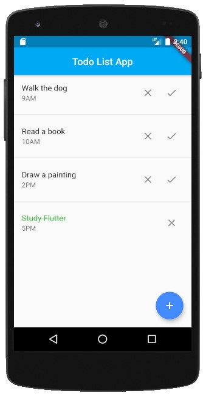
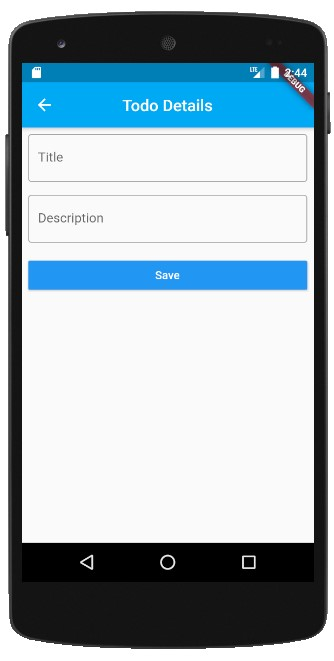

## Documentation

* [Install Flutter](https://flutter.dev/get-started/)
* [Flutter documentation](https://flutter.dev/docs)
* [Development wiki](https://github.com/flutter/flutter/wiki)
* [Contributing to Flutter](https://github.com/flutter/flutter/blob/master/CONTRIBUTING.md)

## About the project

This project is a Todo List made with Flutter.

